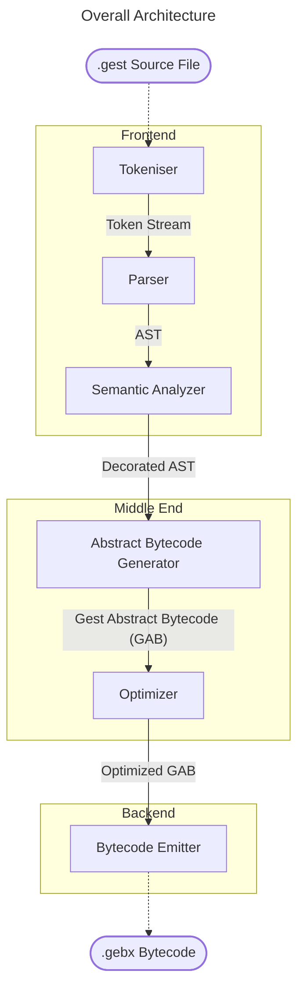
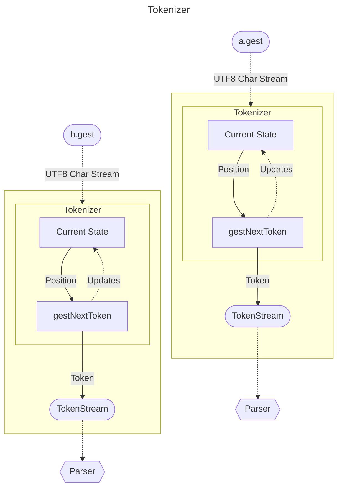

# Gest's Design

First of all, let's start with the obvious: Gest is a Smalltalk derivative. But it doesn't follow Smalltalk through everything. The main aims of gest are to be a fast Smalltalk, to make the elegance of Smalltalk more accessible to a modern programmer audience, and to build a portfolio. As such, for example, it adds operator precedence, a file-based module system, and more.

## Syntax

The following uses ISO/IEC 14977 EBNF syntax.

Spacing characters are assumed to be able to go in between anything unless explicitly specified not to with the E rule.

```ebnf
E = ? no spacing allowed ?;
ANY = ? any character ?;
XID_Start = ? any character that satisfies the unicode property of XID_Start ?;
XID_Continue = ? any character that satisfies the unicode property of XID_Continue ?;

comment = '"', { ANY - '"' }, '"';

(* Define Numbers *)
digit = "0"|"1"|"2"|"3"|"4"|"5"|"6"|"7"|"8"|"9";
hexdigit = digit | "a"|"b"|"c"|"d"|"e"|"f" | "A"|"B"|"C"|"D"|"E"|"F";
integer = digit, { E, digit }
        | "0x", E, hexdigit, { E, hexdigit }
        | "0b", E, ("0" | "1"), { E, ("0" | "1") }
        ;
floating = { digit }, E, ".", E, digit, { E, digit },
         [ E, ("e" | "E"), E, ["+", "-"], E, digit, { E, digit } ]
         ;
number = integer | floating;

string_escape = "\\", E, ( "0" | "a" | "b" | "e"
                         | "f" | "t" | "v" | "r"
                         | "n" | "'" | "\\"
                         | "x", E, hexdigit, E, hexdigit
                         | "u{", ? 1 to 6 hexdigits ?,  "}"
                         );
string = "'",
         { E, ((ANY - ("\\" | "'")) | string_escape) },
         E, "'";

character = "$", E, XID_Start | "$(", ? 1 to 6 hexdigits ?, ")" | "$'", E, ? any codepoint as what it is ?, E, "'";
identifier = (XID_Start | "_"), E, { XID_Continue | "_" }, [ E, "?" ] | ? "$" not followed by an XID_Start character (lookahead) ?;
symbol = "#", E, (identifier | string);

cfactor = symbol
        | character
        | "true"
        | "false"
        | "nil"
        | identifier
        | ['-' | '+'], number
        | string
        | "#(", { cfactor }, ")"
        ;
    
block_arg = identifier | argument; (* types are supported somewhat, if enabled via -fexperiment=typed-funcs, otherwise the argument case is an error *)

block = [ "^" | "@" ], E, "[",
        [ "|", [ block_arg, { ",", block_arg }, [ "," ] ], "|" ], program, "]";
ast_capture = "#[", program, "]";

factor = cfactor
       | "(", expr, ")"
       | "{", [ expr, { ".", expr }, [ "." ] ] ,"}"
       | "#{", [ assoc, { ".", assoc }, [ "." ] ], "}"
       | block
       | ast_capture
       ;

(* Unary *)
postfix = factor, { identifier };
prefix = { ("+" | "-") }, postfix;
mul_div = prefix, { ("*" | "/" | "//" | "\\\\"), prefix };
add_sub = mul_div, { ("+" | "-" | "++"), mul_div };
shift = add_sub, { ("<<" | ">>"), add_sub };
point = shift, { "@", shift };
comparison = point, { ("=" | "~=" | "==" | "~~" |"<=" | ">=" | "<" | ">"), point };
band = comparison, { "&", comparison };
bxor = band, { "xor", band };
bor = bxor, { "|", bxor };
land = bor, { "and", bor };
lor = land, { "or", land };
assoc = lor, { ("=>"), lor };

(*
Custom operators are allowed since the actual impl is a Pratt parser.
But require registration with the operator pragma.
(e.g. pragma operator: #'my_custom_op', assoc: #left, precedence: 9)

Overriding operators is still simple, e.g.
"set string addition to concatenation"
String #'+' = [|x, y| x ++ y]
*)

argument = identifier, E, ":", assoc;
msg_arg = { argument, { ",", argument } };
message = assoc, msg_arg;

id_chain = identifier, { identifier };
imsg_arg = (identifier, { identifier } | msg_arg);
cascade = message, { ";", imsg_arg };
feed = cascade, { "|>", cascade };

destructuring = id_chain
              | "{", [ destructuring, { ".", destructuring }, [ "." ] ], "}"
              | "#{", [ (identifier | lor, "=>", destructuring), { ".", (identifier | lor, "=>", destructuring) }, ["."] ], "}";
destructuring_top = destructuring, { "@", destructuring };
assign = { ("let", destructuring_top | id_chain), ":=" }, feed;

return = [ "^" ], assign;

pragma = "pragma", (identifier | msg_arg);
global_and_nonlocals = "global" | "nonlocal", (identifier { ",", identifier });

expr = return | pragma | global_and_nonlocals;
statement = expr, ".";
program = [ { statement }, expr ];
```

### Examples

#### :wave: Hello, World

```smalltalk
Module import: '@gest/common', for: #{#identity => #id}.

args := Env args asArray.
name := args index?: 1.
"If there is a name, use that name, if not, default to World."
name := name nil? ifFalse: id, else: 'World'.

Module
    export: [ Io printLn: 'Hello ' ++ name ++ '!'. ],
    as: #main.
```

#### :wave: Hello from C

```smalltalk
"libc is predefined, so it has an advantage"
"but the project manager included with gest"
"called palmar allows you to do more."

"A short sum is that you tell palmar what"
"to do to in the palmar.kon file at the"
"top level directory of the project."

stdio := Module externModule: '@system/libc'.
stdio importFns: #[
    (printf format: char const ptr, with: varargs) => int.
].

stdio printf format: 'Hello to %s from C func.\n', with: #('Gest').
```

#### :abacus: Factorial

```smalltalk
"extending the Integer class"
Integer fac := @[
    ^self <= 1
        ifTrue: 1,
        else:   self * (self - 1) fac.
].
"or"
Integer fac := @[
    result := 1.
    2 => self forEach: [|i|
        result := result * i.
    ]
    ^result
].
```

#### :triangular_ruler: Rule 110

```smalltalk
rule110 := ^[ |withDepth|
    printState := [ |state|
        (depth - 1 => 0) stepBy: -1 |> $ forEach: [|i|
            Io print: (state >> i) & 1 ifTrue: ' ', else: '#'.
        ].
    ].
    state := 1.
    1 => withDepth forEach: [|_| 
        printState state: state.
        let sp @ sc @ sn := state >> 1 @ state @ state << 1.
        state := (sp bitnot & sc & sn) | (sc xor sn).
    ].
].
Module export: #rule110.

rule110 withDepth: 100.
```

#### :abacus: Calculator

```smalltalk
Expr := Object subclass.
Expr solve := Block virtual.

LiteralExpr := Expr subclass withSlots: #(value).
LiteralExpr solve := @[^self value].

UnaryExpr := Expr subclass withSlots: #(op inner).
UnaryExpr solve := @[^op = '-' ifTrue: -self value, else: self value].

BinaryExpr := Expr subclass withSlots: #(left op right).
BinaryExpr solve := @[
    ^Select for: op, in: #[
        '+' => left solve + right solve.
        '-' => left solve - right solve.
        '*' => left solve * right solve.
        '/' => left solve / right solve.
        '%' | 'mod' => left solve \\ right solve.
        else: nil.
    ].
].
Expr parse := ^[|src|
    src := src asCharIterator withCursor.
    parseLiteral := ^[|src|
        ^src takeWhile: asciiDigit?
        |> Integer fromStr: $.
    ].
    parseUnary := ^[|src|
        src skipWhile: [|x| x space?].
        src peek asciiDigit? ifTrue: ^parseLiteral src: src.
        op := src takeIf: [|x| '+-' contains: x].
        op nil? ifTrue: [^parseLiteral src: src].
        inner := parseUnary src: src.
        ^UnaryExpr op: op, inner: inner.
    ].
    parseAdd := ^[|src|
        src skipWhile: [|x| x space?].
        left := parseUnary src: src.
        [src notFinished] whileTrue: [|break|
            op := src takeIf: [|x| '+-' contains: x].
            op nil? ifTrue: [
                '*/%' contains: src peek ifTrue: [break loop]
            ].
            src skipWhile: [|x| x space?].
            right := parseUnary src: src.
            left := BinaryExpr left: left, op: op, right: right.
        ].
    ].
    parseMul := ^[|src|
        src skipWhile: [|x| x space?].
        left := parseAdd src: src.
        [src notFinished] whileTrue: [
            op := src takeIf: [|x| '*/%' contains: x].

            src skipWhile: [|x| x space?].
            right := parseAdd src: src.
            left := BinaryExpr left: left, op: op, right: right.
        ].
    ].
    parseMul src: src.
].


Io print: 'Expression: '.
Io stdout flush.
exprStr := Io readLn stripSuffix: Character cr.

expr := Expr parse: exprStr.
result := expr solve.

Io printLn: 'Result: ' ++ result.
```

## Architecture

### Overall Architecture



### Tokenizer


